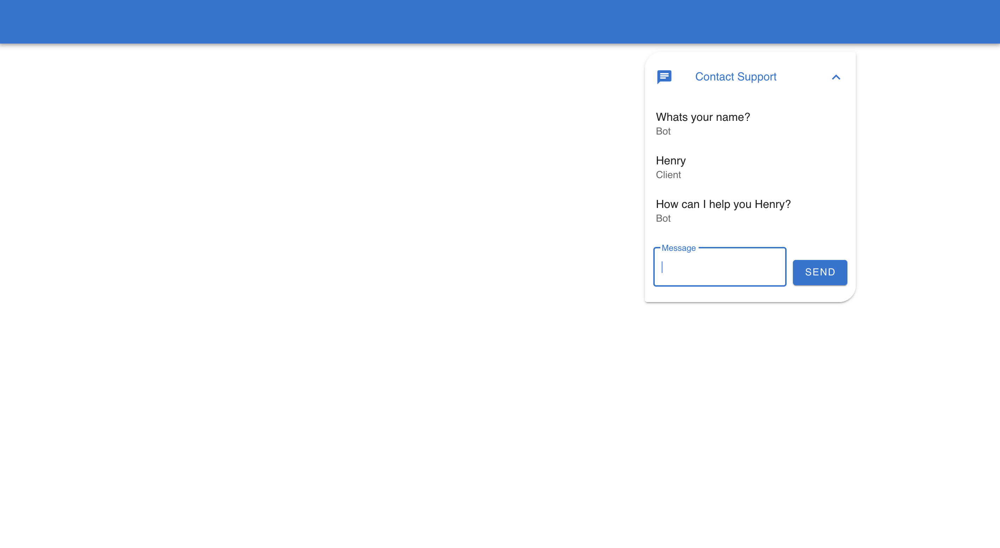

# Chat Bot

An exercise in WebSockets and building an interface with [Vue](https://nextjs.org/) and [Vuetify](https://vuetifyjs.com/en/).



## Getting Started

First, run:

```bash
cd Bot

npm install
```

```bash
cd Chat

npm install
```

Then start the Bot - ws://localhost:3000:

```bash
node index.js
```

Run the Vue App - http://localhost:8080/:

```bash
npm run serve
```
